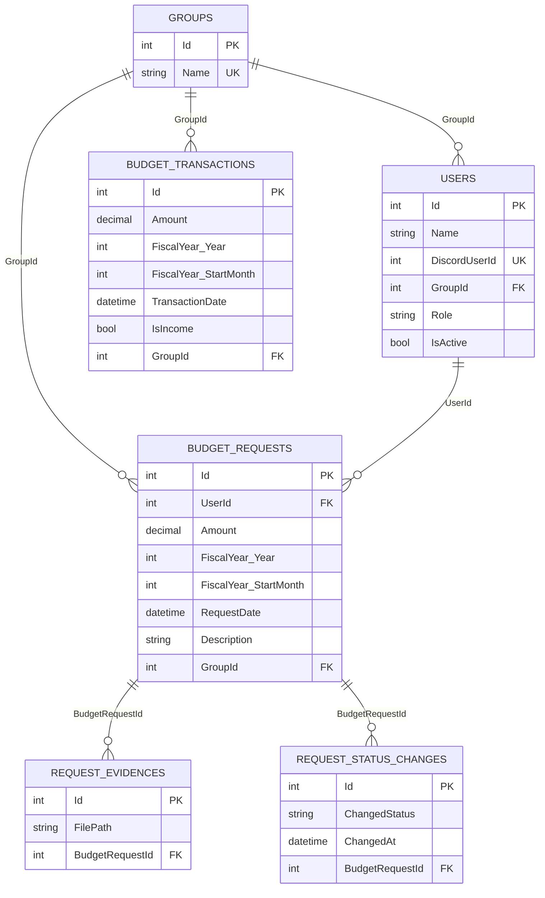
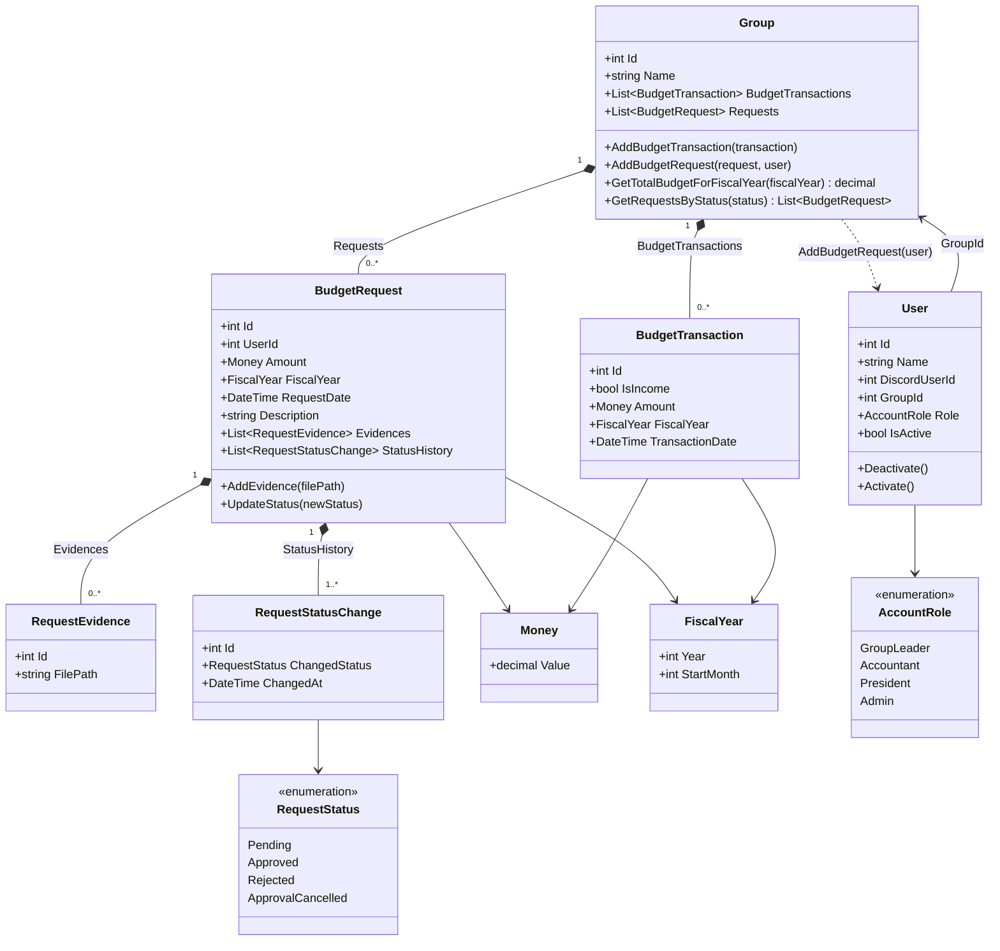

# BudgetManagementBotSystem

Discord上で動作する予算管理Botシステム

## 必要な環境

- .NET 10.0 SDK
- Discord Bot Token
- PostgreSQL データベース（将来の永続化向け）

## セットアップ手順

### 1. リポジトリのクローン

```bash
git clone https://github.com/YOUR_USERNAME/BudgetManagementBotSystem.git
cd BudgetManagementBotSystem
```

### 2. 依存パッケージの復元

```bash
dotnet restore
```

### 3. 設定ファイルの作成

`src/BudgetManagementBotSystem/sample.appsettings.json`を参考に、`appsettings.Development.json`を作成します。

```bash
cp src/BudgetManagementBotSystem/sample.appsettings.json src/BudgetManagementBotSystem/appsettings.Development.json
```

`appsettings.Development.json`を編集し、以下の設定を入力します：

- **Discord:Token**: Discord Developer PortalでBotを作成し、取得したトークンを設定
- **ConnectionStrings:Db**: PostgreSQLの接続文字列を設定（現時点の起動処理では未使用）
- **FiscalYearStartMonth:Month**: 会計年度開始月（例: 4）

```json
{
  "Logging": {
    "LogLevel": {
      "Default": "Information",
      "Microsoft.Hosting.Lifetime": "Information"
    }
  },
  "Discord": {
    "Token": "YOUR_DISCORD_BOT_TOKEN"
  },
  "ConnectionStrings": {
    "Db": "Host=localhost;Database=budget;Username=postgres;Password=YOUR_PASSWORD"
  },
  "FiscalYearStartMonth": {
    "Month": 4
  }
}
```

### 4. PostgreSQLデータベースの準備（任意）

現時点の起動処理ではDB接続は必須ではありません。将来の永続化機能に備えて、必要なら作成しておきます。

```sql
CREATE DATABASE budget;
```

### 5. Discord Botの作成

1. [Discord Developer Portal](https://discord.com/developers/applications)にアクセス
2. 「New Application」をクリックしてアプリケーションを作成
3. 「Bot」タブでBotユーザーを作成
4. 「Token」をコピーして、appsettings.Development.jsonに貼り付け
5. 「OAuth2」→「URL Generator」でBot招待URLを生成
   - Scopes: `bot`
   - Bot Permissions: 必要な権限を選択（メッセージの送信、読み取りなど）
6. 生成されたURLでBotをサーバーに招待

## 実行方法

```bash
dotnet run --project src/BudgetManagementBotSystem/BudgetManagementBotSystem.csproj
```

または、プロジェクトフォルダ内で:

```bash
cd src/BudgetManagementBotSystem
dotnet run
```

### ビルド

```bash
# ビルド
dotnet build

# リリースビルド
dotnet build -c Release
```

## テストの実行

```bash
dotnet test
```

## 現在の実装状況（2026-03時点）

- Worker起動時に `Discord:Token` を読み取り、Discord Botを開始
- スラッシュコマンドをグローバル登録
- 実装済みコマンドは `/test`（動作確認用）
- ドメイン層（Entities / ValueObjects / Enums）は実装済み
- `BudgetRequest` のステータス遷移に対する単体テストを実装
- EF Coreの `BudgetManagementDbContext` とマッピング定義を実装
- `Application` 配下（DTOs/Queries/UseCases）と一部Repository実装は雛形段階

## プロジェクト構成

```text
BudgetManagementBotSystem/
├── src/
│   └── BudgetManagementBotSystem/      # メインプロジェクト
│       ├── Program.cs
│       ├── Worker.cs
│       ├── Application/                # アプリケーション層（雛形）
│       │   ├── DTOs/
│       │   ├── Queries/
│       │   └── UseCases/
│       ├── Domain/                     # ドメイン層
│       │   ├── Entities/              # エンティティ
│       │   ├── Enums/                 # 列挙型
│       │   ├── Repository/            # リポジトリIF
│       │   └── ValueObjects/          # 値オブジェクト
│       └── Infrastructure/             # インフラストラクチャ層
│           ├── Discord/
│           └── Persistence/
│               └── Repository/
└── tests/
    └── BudgetManagementBotSystem.Tests/
        └── Domain/
            └── Entities/
```

## トラブルシューティング

### Botが起動しない場合

- Discord Tokenが正しく設定されているか確認
- BotがサーバーにInviteされているか確認
- 必要な権限が付与されているか確認

### DB接続について

- 現時点の起動処理ではDB接続は必須ではありません
- 永続化機能の実装時に `ConnectionStrings:Db` を利用します

## 使用技術

- .NET 10.0
- Discord.Net 3.18.0
- Entity Framework Core 10.0.3
- Npgsql 10.0.1
- xUnit

## 図

### ER図



### 複合インデックスについて

`RequestStatusChange` には、`BudgetRequestId` と `ChangedAt` の**複合インデックス**を設定しています。

- 設定箇所: `e.HasIndex("BudgetRequestId", nameof(RequestStatusChange.ChangedAt));`
- 並び順は `(BudgetRequestId, ChangedAt)`（先頭キーは `BudgetRequestId`）
- 主な目的は「特定の申請の履歴を時系列で取得するクエリ」の高速化
- 例: `WHERE BudgetRequestId = ? ORDER BY ChangedAt`
- `IsUnique()` を付けていないため、同じ `BudgetRequestId` と `ChangedAt` の組み合わせは重複可能です

> 補足: このインデックスは先頭キーが `BudgetRequestId` のため、`ChangedAt` 単体条件の検索では効果が出にくい場合があります。

### Domainクラス図



## ライセンス

このプロジェクトのライセンスはMITライセンスです。
