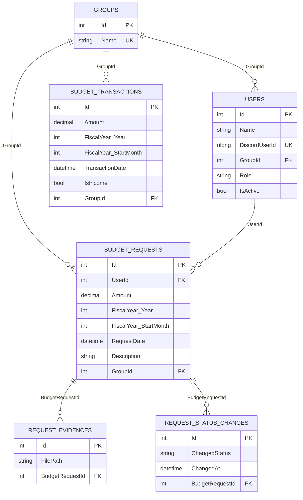
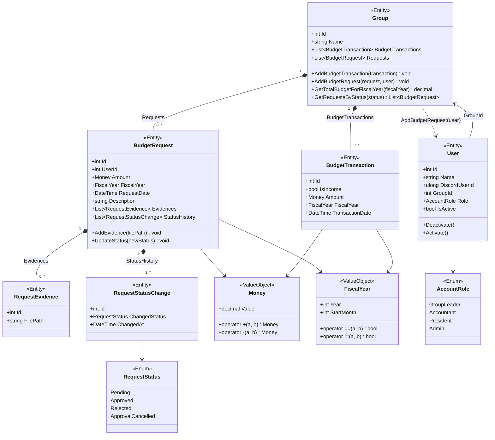

# BudgetManagementBotSystem 設計資料

このドキュメントは、現行実装（2026-03 時点）に合わせた設計資料です。

## アーキテクチャ概要

- Layered Architecture を採用
  - `Domain`: エンティティ / 値オブジェクト / ドメインサービス / Repository IF
  - `Application`: ユースケース（アプリケーションサービス）
  - `Infrastructure`: Discord 連携、EF Core `DbContext`
  - `Presentation`: Discord コマンドモジュール
- 起動時に `Program` で `DbContext`・`DiscordBotService`・`Worker` を DI 登録
- `Worker` が `Discord:Token` を読み、Bot を開始

## ユースケース設計（実装済み）

### SubmitBudgetRequestUseCase

- 入力: `userId(int)`, `groupId(int)`, `amount(decimal)`, `description(string)`
- 処理:
  1. `IUserRepository.GetByIdAsync(int userId)` でユーザー取得
  2. `IGroupRepository.GetByIdAsync(int groupId)` でグループ取得
  3. `amount` のバリデーション（負数禁止）
  4. `BudgetRequest` 生成・グループへ追加
  5. `BudgetRequestBudgetLimitCheckService` で予算上限判定
  6. 上限超過時は `Rejected` に遷移
  7. `IGroupRepository.UpdateAsync` で保存

### IncreaseBudgetLimitUseCase

- 入力: `groupId(int)`, `amount(decimal)`
- 処理:
  1. `IGroupRepository.GetByIdAsync(int groupId)` でグループ取得
  2. `amount` のバリデーション（負数禁止）
  3. 会計年度設定値から `FiscalYear` を生成
  4. 収入 `BudgetTransaction` を追加
  5. `IGroupRepository.UpdateAsync` で保存

## ER図

## 複合インデックスについて

`RequestStatusChange` には、`BudgetRequestId` と `ChangedAt` の複合インデックスを設定しています。

- 設定箇所: `e.HasIndex("BudgetRequestId", nameof(RequestStatusChange.ChangedAt));`
- 並び順は `(BudgetRequestId, ChangedAt)`（先頭キーは `BudgetRequestId`）
- 主な目的は「特定の申請の履歴を時系列で取得するクエリ」の高速化
- 例: `WHERE BudgetRequestId = ? ORDER BY ChangedAt`
- `IsUnique()` を付けていないため、同じ `BudgetRequestId` と `ChangedAt` の組み合わせは重複可能です

> 補足: このインデックスは先頭キーが `BudgetRequestId` のため、`ChangedAt` 単体条件の検索では効果が出にくい場合があります。

## Domainクラス図

## ドメインルール

- `BudgetRequest` の初期ステータスは `Pending`
- ステータス遷移制約
  - `Pending -> Approved | Rejected`
  - `Approved -> ApprovalCancelled`
  - `Rejected` / `ApprovalCancelled` からの遷移は禁止
- `Group.AddBudgetTransaction`
  - 対象会計年度の予算が負になる取引追加を禁止
- `Money`
  - 負値の生成を禁止
  - 減算結果が負になる操作を禁止

## 既知の不整合・未実装

- `Infrastructure/Persistence/Repository/EfCoreGroupRepository.cs` は未実装（空ファイル）
- `IUserRepository` のインフラ実装が未作成
- Discord コマンドは現状 `/test` のみ
