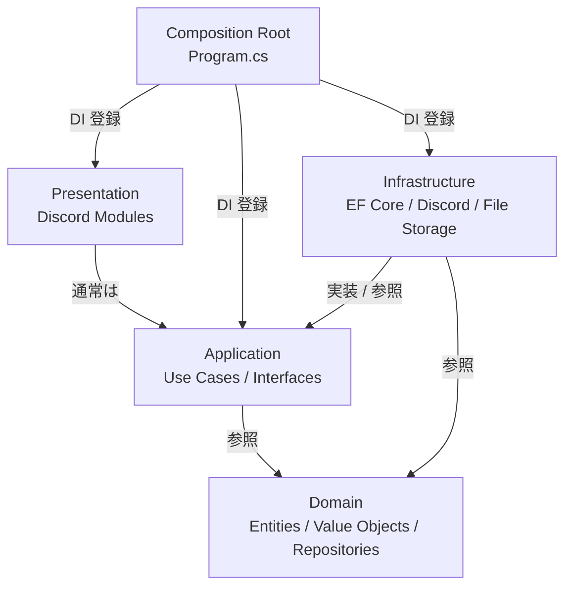

# BudgetManagementBotSystem — レイヤー依存関係図

このドキュメントは、現在のコードベースにおける層単位の依存関係を整理したものです。`Layered Architecture` の観点で、どの層がどの層に依存しているかを図と文章で示します。

## 対象レイヤー

- `Domain`: エンティティ、値オブジェクト、列挙型、Repository インターフェース
- `Application`: ユースケース、アプリケーション向けインターフェース
- `Infrastructure`: EF Core の永続化、Repository 実装、Discord 連携、ファイル保存
- `Presentation`: Discord のスラッシュコマンドモジュール
- `Composition Root`: `Program.cs` による DI 設定

## 依存関係の全体像

## 層ごとの依存関係

### Domain

Domain は最下層として、他の層に依存しません。`Group`、`User`、`BudgetRequest`、`Money`、`FiscalYear` などの業務ルールの中心を持ちます。

### Application

Application は Domain の型と Repository インターフェースを利用してユースケースを実装します。たとえば、申請登録や承認、却下、予算上限の更新は Application のユースケースに集約されています。

### Infrastructure

Infrastructure は Application のインターフェースを実装し、Domain のエンティティを永続化します。`BudgetManagementDbContext`、`EfUnitOfWork`、Repository 実装、`LocalFileStorage`、`DiscordBotService` がこの層にあります。

### Presentation

Presentation は Discord のコマンド入口です。理想的には Application のユースケースだけを呼び出すべきですが、現状の `ApprovalModule` では一部で Domain と Infrastructure に直接アクセスしています。

### Composition Root

`Program.cs` は各層の依存を組み立てるだけの場所です。実処理は持たず、DI 登録を通じて層の接続を担当します。

## 現状の例外

現時点では、`ApprovalModule` が Presentation 層としてはやや強い結合を持っています。

- `IUserRepository` を直接利用してユーザーを引いている
- `BudgetManagementDbContext` を直接利用して申請の検索や状態確認をしている
- 承認・却下は Application のユースケース経由だが、一覧表示と一部の判定は Presentation 側で完結している

このため、現状の実装は「完全に Application 経由」ではなく、Presentation が Domain / Infrastructure に少し踏み込んでいます。

## 目指す形

将来的には、Presentation が Application のユースケースだけを呼び出し、Repository や DbContext の直接参照をなくすと、依存関係はより明確になります。`ApprovalModule` の検索処理も Application 側の Query もしくは UseCase に寄せると、層の責務分離が分かりやすくなります。

## 参照箇所

- [Program.cs](../src/BudgetManagementBotSystem/Program.cs)
- [ApprovalModule.cs](../src/BudgetManagementBotSystem/Presentation/Discord/Modules/ApprovalModule.cs)
- [BudgetManagementDbContext.cs](../src/BudgetManagementBotSystem/Infrastructure/Persistence/BudgetManagementDbContext.cs)
- [EfUnitOfWork.cs](../src/BudgetManagementBotSystem/Infrastructure/Persistence/EfUnitOfWork.cs)
